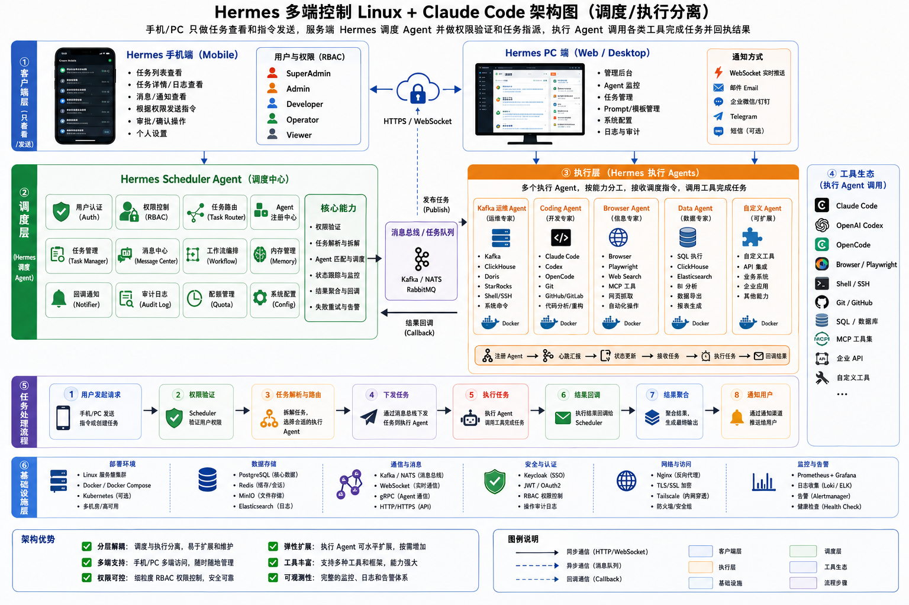

# Hermes 架构设计

**Hermes** — 多端可控 Linux + Claude Code 架构

> 核心设计原则：**调度与执行分离**



---

## 目录

- [客户端层](#客户端层)
- [调度层](#调度层)
- [消息总线 / 任务队列](#消息总线--任务队列)
- [执行层](#执行层)
- [工具生态](#工具生态)
- [任务处理流程](#任务处理流程)
- [基础设施层](#基础设施层)
- [架构优势](#架构优势)

---

## 客户端层

客户端层负责**只读与发送**，提供多端接入能力。

| 终端 | 能力 |
|------|------|
| **Hermes Mobile** | 查看任务列表、日志、通知；发送授权命令；审批操作；个人设置 |
| **Hermes PC (Web / Desktop)** | 后台管理、Agent 监控、任务/Prompt/模板管理、系统配置、审计 |

**用户与权限 (RBAC)**：SuperAdmin、Admin、Developer、Operator、Viewer

**通知方式**：WebSocket 实时推送、Email、企业微信/钉钉、Telegram、可选 SMS

**通信协议**：HTTPS + WebSocket

---

## 调度层

**Hermes Scheduler Agent** — 系统中枢，负责调度与编排。

### 内部模块

- 用户认证 (User Auth)
- RBAC 权限控制
- 任务路由 (Task Router)
- Agent 注册中心
- 任务管理 (Task Manager)
- 消息中心
- 工作流编排 (Workflow Orchestration)
- 记忆管理 (Memory Management)
- 通知回调 (Notifier)
- 审计日志 (Audit Log)
- 配额管理 (Quota Management)
- 系统配置 (System Config)

### 核心能力

- 权限校验
- 任务解析与拆解
- Agent 匹配与调度
- 状态跟踪与监控
- 结果聚合
- 失败重试与告警

---

## 消息总线 / 任务队列

调度层与执行层之间的桥梁，采用异步消息传递。

**技术选型**：Kafka、NATS 或 RabbitMQ

| 方向 | 说明 |
|------|------|
| 调度 → 队列 | 发布任务 (Publish) |
| 队列 → 调度 | 结果回调 (Result Callback) |

---

## 执行层

**Hermes Execution Agents** — 运行在 Docker 容器中的专业化 Agent。

| Agent | 职责 |
|-------|------|
| **Kafka O&M Agent** | Kafka、ClickHouse、Doris 运维及系统级 Shell 命令 |
| **Coding Agent** | 集成 Claude Code、Codex、OpenCode；Git/GitHub/GitLab 代码分析与重构 |
| **Browser Agent** | Playwright + Web Search，网页抓取与自动化操作 |
| **Data Agent** | SQL 执行、BI 分析、数据导出 (ClickHouse、Elasticsearch) |
| **Custom Agent** | 可扩展模块，支持自定义工具、API 集成与业务系统对接 |

### Agent 生命周期

```
注册 Agent → 心跳 → 状态更新 → 接收任务 → 执行 → 返回结果
```

---

## 工具生态

执行 Agent 可调用的工具集：

- Claude Code
- OpenAI Codex
- Browser / Playwright
- Shell / SSH
- Git
- SQL 数据库
- **MCP (Model Context Protocol) 工具集**

---

## 任务处理流程

```
1. 用户请求        ← Mobile / PC 发起
2. 权限校验        ← Scheduler 处理
3. 任务解析与路由   ← 拆解任务、选择 Agent
4. 下发任务        ← 经消息总线投递
5. 执行任务        ← Agent 调用工具完成
6. 结果回调        ← 返回 Scheduler
7. 结果聚合        ← 合并为最终输出
8. 通知用户        ← 推送至客户端
```

---

## 基础设施层

| 类别 | 技术栈 |
|------|--------|
| **部署** | Linux 集群、Docker/Compose、Kubernetes |
| **数据存储** | PostgreSQL (核心)、Redis (缓存)、MinIO (文件)、Elasticsearch (日志) |
| **通信** | Kafka/NATS、WebSocket、gRPC、HTTP/HTTPS |
| **安全** | Keycloak (SSO)、JWT/OAuth2、RBAC、审计日志 |
| **网络** | Nginx、TLS/SSL、Tailscale、防火墙 |
| **监控** | Prometheus、Grafana、Loki/ELK、Alertmanager |

---

## 架构优势

| 特性 | 说明 |
|------|------|
| **解耦** | 调度与执行分离，便于独立维护与升级 |
| **多端** | Mobile + PC 随时随地管理 |
| **可控** | 细粒度 RBAC 权限体系 |
| **弹性** | 执行 Agent 可水平扩展 |
| **工具丰富** | 支持多种框架与 MCP 工具集 |
| **可观测** | 完整的监控与日志体系 |

### 图例说明

- **实线**：同步通信 (HTTP / WebSocket)
- **虚线**：异步通信 (Message Queue)
- **点线**：回调通信
